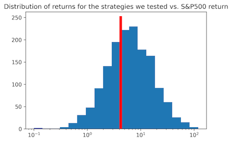

## Dishonest chart:
100x your money using our proprietary strategy (every 3 days, find the 9th worst preforming stock that day, invest all your money in it, and sell 3 days later)

From 2011 to 2016, the return stays around 0%. Beginning 2017, the return has an initial slight increase, but then begins to exponentially increase after that. By 2021, the return values hit a peak of about 15,000%. Despite waiting many years, our strategy, which is simply one of infinitely many, has evidently succeeded. However, as demonstrated by the chaotic growth of our strategy, the stock market can be volatile, making accurate forcasting of future returns near impossible.  

## Honest chart:

We were dishonest in our deceptive chart because we cherry picked one datapoint from the many strategies we tried. We were only able to choose the best strategy because we had access to all the stock price data. If you actually wanted to use our investment strategy, you would need data from the future.

In our honest chart, we wanted to be more realistic about your odds of making money if you followed our strategy. Instead of picking the best preforming strategy, we showed the performance of all of the strategies we tried (1st worst stock every day, 1st worst every 2 days, ..., 2nd worst every day, 2nd worst every 2 days...). Just as we did for the deceptive chart, we compared our strategy's profit to the profit you would have gotten if you just invested in the S&P 500.

We chose a histogram because we waned to highlight the probabilistic nature of our strategies' potential returns. It is easy to see your odds of beating the S&P 500, because it is equal to the area under the curve to the right of the red line. We chose to use a log scale on our x-axis because the distribution of profits is log-normal, so on a log scale the distribution looks normal.

## Dishonest chart (log scale):

## Honest chart 2:

